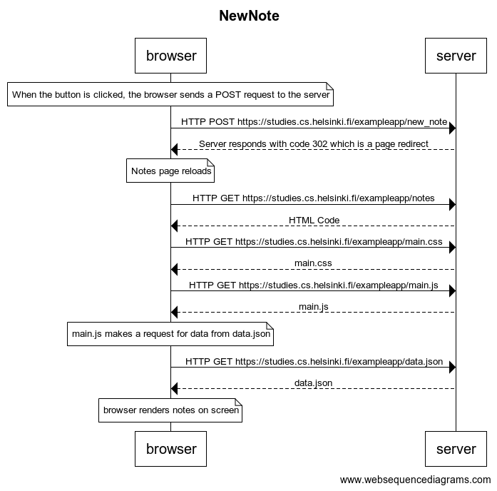
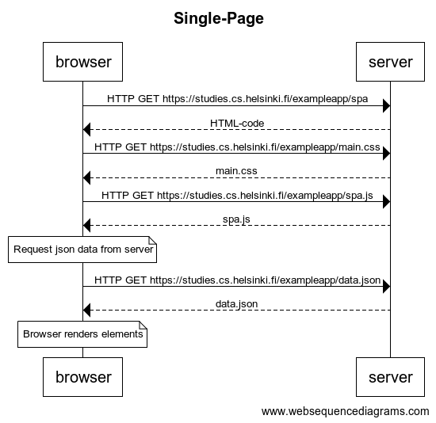
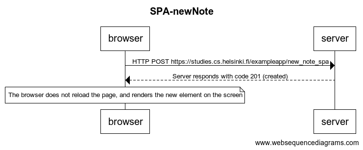

# [Fundamentals of Web apps](https://fullstackopen.com/en/part0/fundamentals_of_web_apps)

## 0.4: new note

Create a diagram depicting the situation where the user creates a new note on page https://studies.cs.helsinki.fi/exampleapp/notes by writing something into the text field and clicking the submit button.

### Solution



By https://www.websequencediagrams.com/

```
title NewNote
note over browser: When the button is clicked, the browser sends a POST request to the server
browser->server: HTTP POST https://studies.cs.helsinki.fi/exampleapp/new_note
server-->browser: Server responds with code 302 which is a page redirect
note over browser: Notes page reloads
browser->server: HTTP GET https://studies.cs.helsinki.fi/exampleapp/notes
server-->browser: HTML Code
browser->server:HTTP GET https://studies.cs.helsinki.fi/exampleapp/main.css
server-->browser: main.css
browser->server:HTTP GET https://studies.cs.helsinki.fi/exampleapp/main.js
server-->browser:main.js
note over browser: main.js makes a request for data from data.json
browser->server: HTTP GET https://studies.cs.helsinki.fi/exampleapp/data.json
server-->browser:data.json
note over browser: browser renders notes on screen

```

## 0.5: Single page app

Create a diagram depicting the situation where the user goes to the single page app version of the notes app at https://studies.cs.helsinki.fi/exampleapp/spa.

### Solution



```
title Single-Page

browser->server: HTTP GET https://studies.cs.helsinki.fi/exampleapp/spa
server-->browser: HTML-code
browser->server: HTTP GET https://studies.cs.helsinki.fi/exampleapp/main.css
server-->browser: main.css
browser->server: HTTP GET https://studies.cs.helsinki.fi/exampleapp/spa.js
server-->browser: spa.js
note over browser: Request json data from server
browser->server: HTTP GET https://studies.cs.helsinki.fi/exampleapp/data.json
server-->browser: data.json
note over browser: Browser renders elements

```

## 0.6: New note on Single page app

Create a diagram depicting the situation where user creates a new note using the single page version of the app.

### Solution



```
title SPA-newNote

browser->server: HTTP POST https://studies.cs.helsinki.fi/exampleapp/new_note_spa
server-->browser: Server responds with code 201 (created)
note over browser: The browser does not reload the page, and renders the new element on the screen


```
